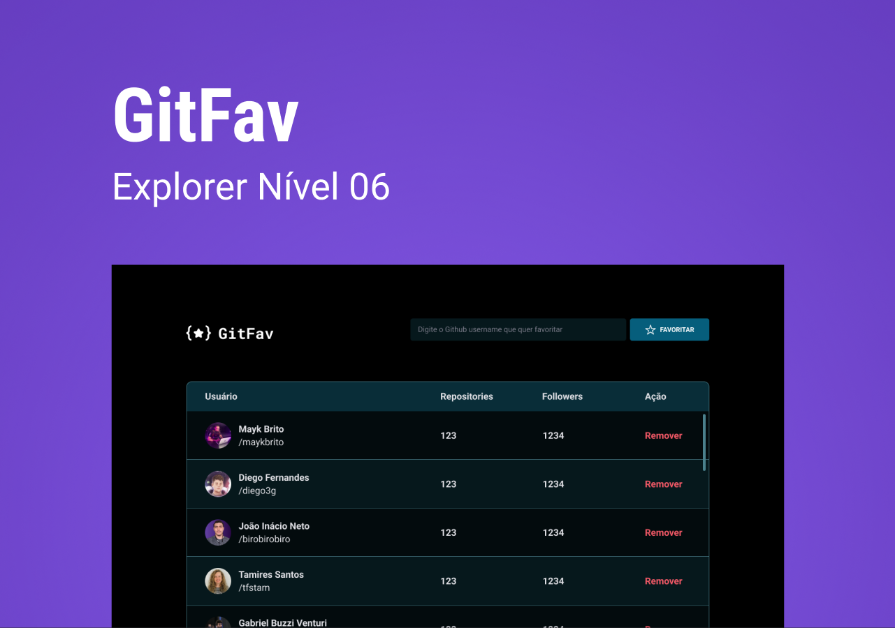
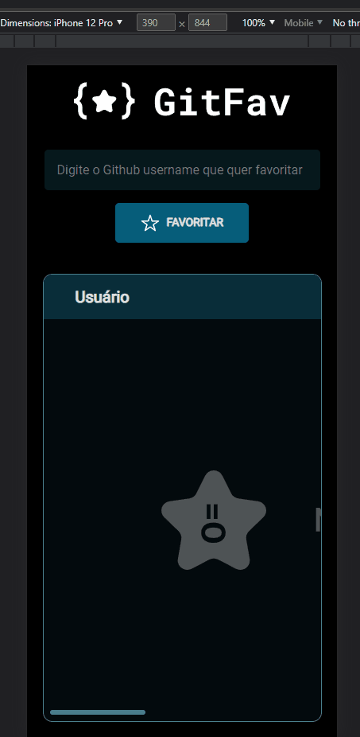
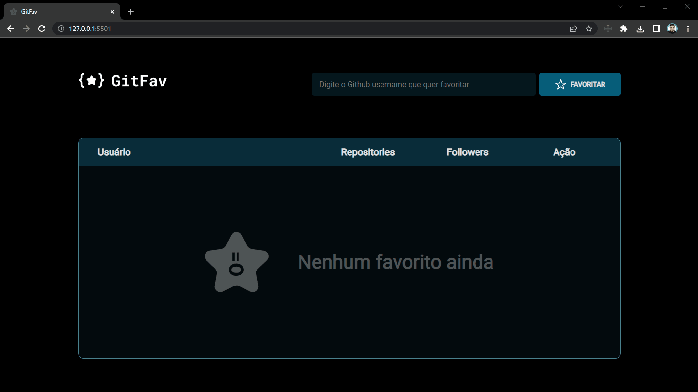

# :heart: GitFav

Esse projeto é uma aplicação para guardar seus perfis favoritos do Github.

<h1 align="center">
    
</h1>

-   [Pré-Visualização](#clapper-pré-visualização)
-   [Aviso](#loudspeaker-aviso)
-   [Sobre](#memo-sobre)
-   [Tecnologias](#floppy_disk-tecnologias)
-   [Funcionalidades](#hammer-funcionalidades)
-   [Utilização](#bulb-utilização)
-   [Autor](#nerd_face-autor)

 

## :clapper: Pré-Visualização

<h1 align="center" style="max-width: 412px; margin: auto;">
    
</h1>

<h1 align="center">
    
</h1>

 

## :loudspeaker: Aviso

-   O projeto **está finalizado**, porém futuras correções podeeão ser feitas.

-   A aplicação funciona melhor em navegadores baseados no Chromium (Chrome, Edge, Brave...);

-   Para testar o projeto basta [CLICAR AQUI!](https://git-fav-two.vercel.app/)

-   O layout foi criado por Daniel Duarte (Product Designer).

 

## :memo: Sobre

Este é um dos projetos propostos no programa [Explorer da Rocketseat](https://www.rocketseat.com.br/explorer), os [detalhes estão aqui](https://efficient-sloth-d85.notion.site/GitFav-f8ff1c18b23745c0b46cd8d61f74b596), mas basicamente é uma aplicação que busca perfis no github e apresenta eles em uma tabela.

Além de trabalhar o HTML, CSS, JS e Git, o projeto tem a intenção de trabalhar com alguns conceitos do **clean code** e **Programação Orientada a Objetos**, como por exemplo:

-   Desestruturação;
-   Modularização;
-   Classes;
-   Herança;
-   Imutabilidade;

 

## :floppy_disk: Tecnologias

-   **HTML** - usada para fazer a estrutura do conteúdo;
-   **CSS** - utilizada para fazer a estilização dos elementos;
-   **JS** - usada para fazer a interatividade da página;
-   **Git** - utilizada para realizar o versionamento do código.

 

## :hammer: Funcionalidades

-   [x] Apresentar uma tabela;
-   [x] Buscar usuários do github;
-   [x] Mostrar usuários adicionados anteriormente (se houver);
-   [x] Excluir um usuário que já foi adicionado;
-   [x] Alertar que o usuário já foi adicionado;
-   [x] Alertar que o usuário não foi encontrado.

 

## :nerd_face: Autor

Feito com :heart: por Dev Gustavo Santos :grinning: Veja meu [LinkedIn.](https://www.linkedin.com/in/devgustavosantos/)
